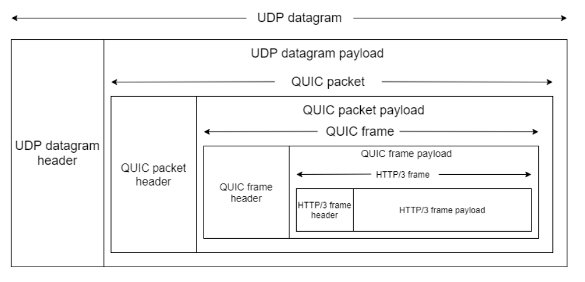
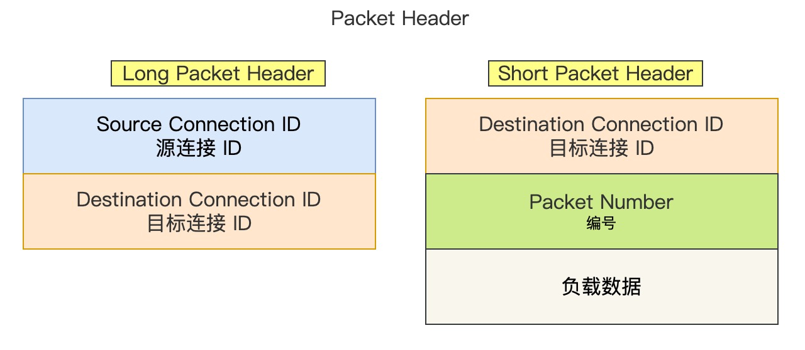

# 基于UDP协议实现可靠传输

## QUIC协议

面对TCP协议存在的缺陷，HTTP/3将传输层上一直以来使用的TCP协议更换为了QUIC协议。QUIC协议是一种基于UDP协议实现的可靠传输协议，在UDP对HTTP包进行封装前，依次通过QUIC Frame Header和QUIC Packet Header头部封装。一个QUIC包是由一个公共的头（QUIC Packet Header）携带一个或多个由QUIC Frame Header封装的帧组成的，其中QUIC Packet Header为明文，QUIC Frame Header和数据部分组成的部分为密文

相比TCP协议/UDP协议，QUIC协议具备如下优点：**更小的RTT握手时延、多路复用、连接迁移、内置加密、可靠传输机制、灵活的帧结构**

### QUIC Frame Header

通过QUIC Freame Header封装HTTP/3包形成Feame，每个Frame都有自己的类型且不再单独传输，而是作为逻辑块被拆分或组合放入Packet中。

### QUIC Packet Header
将多个Frame打包近一个QUIC Packet中，并对Frame集合进行加密。

QUIC Packet Header分为两种：
- Long Packet Header用于首次建立连接；
- Short Packet Header用于传输数据；

QUIC 也是需要三次握手来建立连接的，主要目的是为了协商连接 ID。协商出连接 ID 后，后续传输时，双方只需要固定住连接ID，从而实现连接迁移功能。所以，传输数据的Short Packet Header不需要在传输Source Connection ID字段了，只需要传输Destination Connection ID。

### 

## KCP协议

KCP协议是一种**快速可靠协议（Fast & Reliable Protocol）**，主要用于在UDP上提供类似KCP的可靠传输，其目标为：
- **比TCP更快**（尤其是高延迟、丢包网络环境下）
- **保持可靠性**（保证数据顺序、完整性）
- **低延迟**（适合实时应用）

可以理解为**KCP = UDP + 自己实现的可靠性与拥塞控制机制**。

### KCP的关键机制

1. 快速重传
    - TCP通常需要等待超时才会重传（RTT较长时，延迟明显）；
    - KCP通过ACK确认机制，快速发现丢包并立即重传。
2. 选择性确认（Selective ACK，SACK）
    - TCP在丢包时可能会重传多个数据段（冗余）；
    - KCP只重传丢失的包。
3. 流量控制和滑动窗口
    - KCP实现了自己的滑动窗口，可以控制数据发送速率。
4. 可调模式
    - 用户可根据需要选择不同的传输模式：追求低延迟、追求带宽利用率。
5. FEC（前向纠错）
    - 配合FEC，可在弱网下减少重传，提高效率。